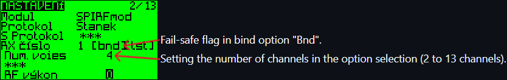

## RC receiver with outputs for motors, servos and telemetry
Hardware includes nRF24L01+ transceiver, ATmega328P/PB processor and motor driver.

The motor driver IC is based on MX1208, MX1508, MX1515, MX1616, MX1919 and others similar, which uses 4x PWM input control signals.

Telemetry sends measured voltage and "fake" RSSI (the nRF24L01+ transceiver does not contain real RSSI and is only a rough counting of lost packets).

The code is Arduino.

### Works with RC transmitters
* [**TX_nRF24_2ch_OLED**](https://github.com/stanekTM/TX_nRF24_2ch_OLED)
* [**TX_nRF24_Xch_LED**](https://github.com/stanekTM/TX_nRF24_Xch_LED)
* [**OpenAVRc**](https://github.com/Ingwie/OpenAVRc_Dev)   <a href="https://github.com/Ingwie/OpenAVRc_Dev"></a>

* [**Multiprotocol TX**](https://github.com/stanekTM/TX_FW_Multi_Stanek) from my fork    <a href="https://github.com/stanekTM/TX_FW_Multi_Stanek"></a>

### RC receiver specification
* Operating Voltage: 3.3V - 6.0V (target typically 4.2V, 1S LiPo)
* Working current of the motor driver MX1508: 1.5A (peak current up to 2.5A)

### RC receiver configuration manual in the "Config.h" file
* Setting a unique address. It is hardcoded into the firmware of RC transmitter openAVRc and Multiprotocol TX
* RF channel setting. It is hardcoded into the firmware of RC transmitter openAVRc and Multiprotocol TX
* Setting the maximum nominal battery voltage
* Setting the minimum battery voltage for alarm
* Servo and motor output selection
* Setting the number of servo channels
* Setting the PWM prescaler according to the requirements and limitations of the timers/counters. Details in the "PWM" file
* Setting the motor reaction point. Prevents initial rotor magnetic resistance
* Setting the maximum motor power. Suitable for RC transmitters without endpoint setting
* Brake setting
* Pin settings specific to my [PCB](documents/2micro_rx_layout.png)
* Setting fail-safe servo channels outside of motor channels (motor 1 and 2 fixed in neutral)

### LED mode
* Normal mode, LED is lit
* If the RC receiver battery is low, the LED blink at 0.3s interval
* If we lose RF data for 1 second, the LED blink at 0.1s interval (fail-safe)
* If we save the fail-safe state, the LED blink at 0.5s interval

### Arduino pins
```
D0  - servo    (1) (1)
D1  - servo    (2) motor 2/1 ATmega328PB only!
D2  - servo 1  (3) motor 2/2 ATmega328PB only!
D3  - servo 2  motor 1/1
D4  - servo 3  (4) (2)
D5  - servo 4  (5) (3)
D6  - servo 5  (6) (4)
D7  - servo 6  (7) (5)
D8  - servo 7  (8) (6)
D9  - servo 8  (9) (7) motor 2/1
D10 - servo 9  (10)(8) motor 2/2
D11 - servo 10 motor 1/2
D12 - servo 11 (11)(9)
D13 - servo 12 (12)(10)

A5  - fail-safe button
A6  - LED
A7  - telemetry analog input RX battery

nRF24L01+
A0  - CE
A1  - CSN
software SPI
A2  - SCK
A3  - MOSI
A4  - MISO
```
### Micro RC receiver
<a href="https://youtu.be/E0pgMNPuYU4"></a>


### RC receiver with tank-arcade mix
<a href="https://youtu.be/AYgY5UkVnUM"></a>

### RC receiver with servo
<a href="https://youtu.be/jPN5YdQ-3K0"></a>
